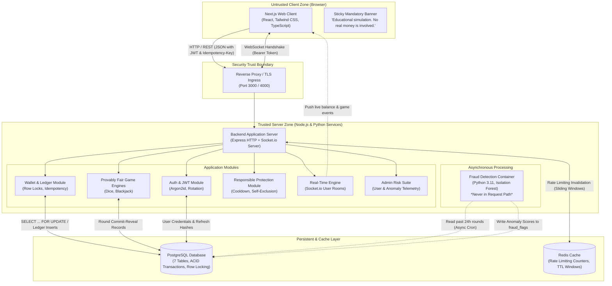

# System Architecture & Trust Boundary

```mermaid
flowchart TD
    subgraph Untrusted_Zone ["Untrusted Client Zone (Browser)"]
        UI["Next.js Web Client<br/>(React, Tailwind CSS, TypeScript)"]
        Banner["Sticky Mandatory Banner<br/>'Educational simulation. No real money is involved.'"]
    end

    subgraph Trust_Boundary ["Security Trust Boundary"]
        ReverseProxy["Reverse Proxy / TLS Ingress<br/>(Port 3000 / 4000)"]
    end

    subgraph Trusted_Zone ["Trusted Server Zone (Node.js & Python Services)"]
        Server["Backend Application Server<br/>(Express HTTP + Socket.io Server)"]

        subgraph Modules ["Application Modules"]
            Auth["Auth & JWT Module<br/>(Argon2id, Rotation)"]
            WalletMod["Wallet & Ledger Module<br/>(Row Locks, Idempotency)"]
            Games["Provably Fair Game Engines<br/>(Dice, Blackjack)"]
            Protect["Responsible Protection Module<br/>(Cooldown, Self-Exclusion)"]
            Realtime["Real-Time Engine<br/>(Socket.io User Rooms)"]
            Admin["Admin Risk Suite<br/>(User & Anomaly Telemetry)"]
        end

        subgraph Async_Jobs ["Asynchronous Processing"]
            FraudJob["Fraud Detection Container<br/>(Python 3.11, Isolation Forest)<br/>*Never in Request Path*"]
        end
    end

    subgraph Data_Storage ["Persistent & Cache Layer"]
        Postgres[("PostgreSQL Database<br/>(7 Tables, ACID Transactions, Row Locking)")]
        RedisCache[("Redis Cache<br/>(Rate Limiting Counters, TTL Windows)")]
    end

    %% Connections
    UI -->|"HTTP / REST (JSON with JWT & Idempotency-Key)"| ReverseProxy
    UI <-->|"WebSocket Handshake (Bearer Token)"| ReverseProxy
    ReverseProxy --> Server

    Server --> Auth
    Server --> WalletMod
    Server --> Games
    Server --> Protect
    Server --> Realtime
    Server --> Admin

    Server <-->|"Rate Limiting Invalidation (Sliding Windows)"| RedisCache
    WalletMod <-->|"SELECT ... FOR UPDATE / Ledger Inserts"| Postgres
    Games <-->|"Round Commit-Reveal Records"| Postgres
    Auth <-->|"User Credentials & Refresh Hashes"| Postgres

    FraudJob -.->|"Read past 24h rounds (Async Cron)"| Postgres
    FraudJob -.->|"Write Anomaly Scores to fraud_flags"| Postgres
    Realtime -.->|"Push live balance & game events"| UI
```

